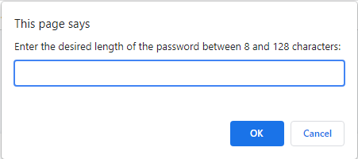
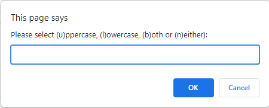
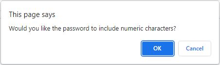
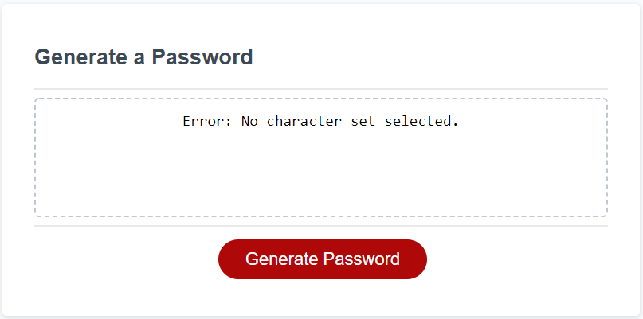
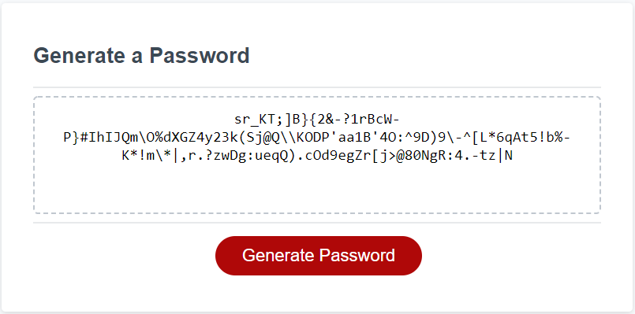

# 03 JavaScript Homework: Password Generator, Readme.md

## Task
This week’s homework required us to implement a random password generator based on criteria solicited from the user. The purpose of this exercise is to model dynamically updated HTML and CSS with Javascript running inside a browser.

## Implementation and Evaluation Criteria:

### Top Down Design
1. Generate a series of user prompts to solicit and store user password criteria. 
  - Solicit the character length of the password from the user with a prompt box.
  - Solicit (u)ppercase, (l)owercase, (b)oth or (n)either from the user with a prompt box.
  - Solicit is the user prefers the use of numeric characters with a confirmation box.
  - Solicit is the user prefers the use of special characters with a confirmation box.
  - If no character type sets are selected, cast a user error. 
  
2. Assemble the password selection pool based on the user provided criteria.
  - If the user selected (u)ppercase only, return the uppercase set of characters.
  - If the user selected (l)owercase only, return the lowercase set of characters.
  - If the user selected (b)oth uppercase and lowercase, return the lowercase concatenated to the uppercase set of characters.
  - If the user selected (n)either, return an empty array.

3.  Generated the random password string.
  - Iterate one random character.
    ##### Return, as the selection index, the floor of the product of the length of the selection array and a psuedo-random variable (0.0 - 1.0).
    ##### Return the character from the selecton array indexed by the selection index.
  - Iterate over the number of characters indicated by the user.
  - Typecast the array to a string.  
  
* Solicit the desired number of characters, 8 - 128, from the user. 

The user is prompted for the number of desired random characters using prompt box:

"getNumbericInpuy", the method called by the prompt box, continues to call itself until a numeric value between 8 and 128 inclusive is entered.

* Get the user preference for uppercase, lowercase, both or neither. 

The user may select (u)ppercase, (l)owercase, (b)oth or (n)either characters with the ensuing prompt box.

getAlphaCharInput continues to call itself until the user input (shifted to lowercase) is within it's calling "returnConstraint" parameter. 

* Get the user preference for numerals, and/or special characters.

The user may select numeric characters and/or special characters by confirming the following two confirmation boxes.

* At least one character set type must be selected or cast an error.

In this instance, the user selected (n)either and canceled both numeric and special characters cause the casting of an error. 

* Generate a strong random password that conforms to user criteria.

In this instance, the user has selected 128 (b)oth uppercase and lowercase and included numeric and special characters.

See the code for this project at:
- https://github.com/mjtanner-github/03-JavaScript-Homework

See a working model at:  
- https://mjtanner-github.github.io/03-JavaScript-Homework/
